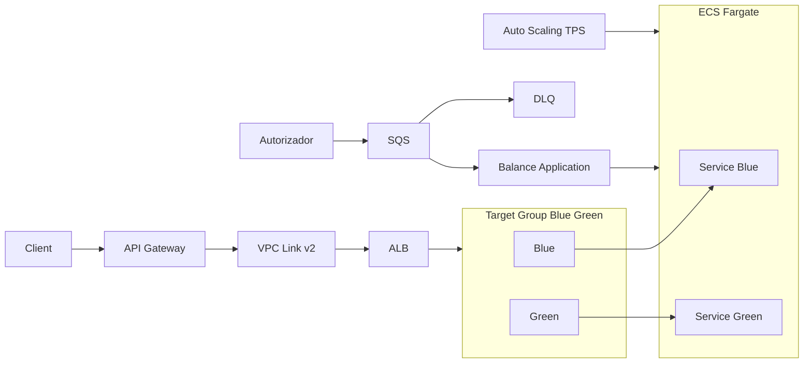

# Balance-application

## Execucao local

Requisitos:
- Java 21
- Docker e Docker Compose

Suba as dependencias (LocalStack + DynamoDB + gerador de mensagens):

```bash
docker compose up -d localstack dynamodb-init message-generator
```

Suba a aplicacao localmente:

```bash
cd Balance-application
./gradlew bootRun
```

Ou gere o jar e execute:

```bash
cd Balance-application
./gradlew clean build -x test
java -jar build/libs/desafio-0.0.1-SNAPSHOT.jar
```

Variaveis de ambiente importantes (valores default em `src/main/resources/application.yml`):
- `AWS_REGION=sa-east-1`
- `DYNAMODB_ENDPOINT=http://localhost:4566`
- `SQS_ENDPOINT=http://localhost:4566`
- `QUEUE_NAME=transacoes-financeiras-processadas`

## Docker Compose (dependencias)

O arquivo `docker-compose.yml` sobe:
- `localstack` com SQS e DynamoDB
- `dynamodb-init` para criar a tabela `tb_balance`
- `message-generator` para popular a fila `transacoes-financeiras-processadas`
- `desafio-app` (opcional) para rodar a aplicacao em container

Para subir tudo:

```bash
docker compose up --build
```

## Colecao de requisicoes

Endpoint disponivel:

```bash
GET http://localhost:8080/balances/{accountId}
```

Exemplo com curl:

```bash
curl http://localhost:8080/balances/{accountId}
```

Exemplo de colecao Postman (salve como `balance-collection.json` e importe no Postman):

```json
{
  "info": {
    "name": "Balance Application",
    "schema": "https://schema.getpostman.com/json/collection/v2.1.0/collection.json"
  },
  "item": [
    {
      "name": "Get Balance",
      "request": {
        "method": "GET",
        "url": {
          "raw": "http://localhost:8080/balances/{{accountId}}",
          "protocol": "http",
          "host": ["localhost"],
          "port": "8080",
          "path": ["balances", "{{accountId}}"]
        }
      }
    }
  ],
  "variable": [
    {
      "key": "accountId",
      "value": "seu-account-id"
    }
  ]
}
```

## Arquitetura em producao (exemplo)

Diagrama ilustrativo com blue/green no target group, consumo via SQS do sistema Autorizador e auto scaling por TPS:



Descricao do deploy blue/green:
1. A versao Blue esta recebendo 100% do trafego no ALB.
2. A versao Green e criada no ECS Fargate com o novo release.
3. Health checks e testes validam a Green sem impactar usuarios.
4. O ALB troca o target group para Green (100% ou canario).
5. Se houver problema, o trafego volta para Blue rapidamente.
